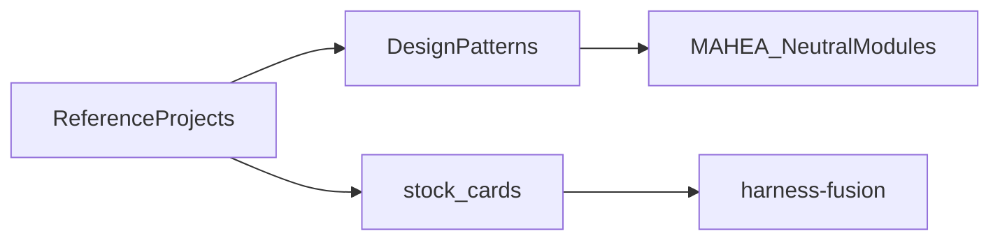

# harness-fusion — 多项目融合说明

> 原则：MAHEA **重组**多方设计模式为中性骨架，**不复刻**任一单一 Harness。  
> 来源登记见 [`stock/`](../stock/)。未核验细节不写成事实。

## 融合方法

1. 抽取可复用**设计模式**（扩展面、节奏、编排、记忆、沙箱等）。
2. 映射到 MAHEA **中性目录**（`kernel` / `layers` / `caps` / …）。
3. 在 `stock/` 保留 URL 与核验状态；禁止伪造能力。

## 逐项贡献与重组落点

### Claude Code

| 贡献的设计模式 | MAHEA 重组落点 |
|----------------|----------------|
| Hooks 生命周期切入 | `caps/hooks/`、`src/capabilities/hooks/` |
| Skills 可复用技能包 | `caps/skills/` |
| Plugins 扩展装载 | `caps/plugins/` |
| Subagents 多代理角色 | `agents/`、`layers/orchestration/` |

素材：[stock/harnesses/claude-code.md](../stock/harnesses/claude-code.md)

### Codex（OpenAI）

| 贡献的设计模式 | MAHEA 重组落点 |
|----------------|----------------|
| 终端/CLI 编码代理形态 | `protocols/cli/` |
| 会话节奏（Thread/Turn/Step 类思想的中性表达） | `kernel/`、`layers/orchestration/` |
| Model Provider 分层 | `models/providers/`、`models/adapters/` |
| 偏 Rust/内核分离的启发（不绑定实现语言） | `kernel/` + `src/kernel/`（Python 占位） |

素材：[stock/harnesses/openai-codex.md](../stock/harnesses/openai-codex.md)  
说明：具体内部类型名以 upstream 为准；MAHEA 使用 `handle_turn` / `next_step` 等中性接口。

### Grok Build

| 贡献的设计模式 | MAHEA 重组落点 |
|----------------|----------------|
| Sandbox 执行 | `sandbox/` |
| 命令/操作审批 | `governance/`、`layers/action/`、`protocols/cli/` |
| 可扩展 TUI/人机交互面 | `protocols/cli/`、`observability/`（交互轨迹） |

素材：[stock/harnesses/grok-build.md](../stock/harnesses/grok-build.md)

### DeepSeek Harness

| 贡献的设计模式 | MAHEA 重组落点 |
|----------------|----------------|
| 一切皆插件 | `caps/plugins/` |
| 微内核 + 挂载总线 | `kernel/`（薄内核） |

素材：[stock/harnesses/deepseek-harness.md](../stock/harnesses/deepseek-harness.md)（`pending`：缺独立权威 URL 时不编造）

### CrewAI

| 贡献的设计模式 | MAHEA 重组落点 |
|----------------|----------------|
| Crews + Flows | `layers/orchestration/` |
| Agent / Task / Crew 角色分工 | `agents/` |

素材：[stock/harnesses/crewai.md](../stock/harnesses/crewai.md)

### Semantic Kernel

| 贡献的设计模式 | MAHEA 重组落点 |
|----------------|----------------|
| Kernel 作为组合/DI 中枢 | `kernel/`、`src/kernel/` |
| Planner | `layers/orchestration/` |
| Memory Connectors | `memory/` |

素材：[stock/harnesses/semantic-kernel.md](../stock/harnesses/semantic-kernel.md)

### LlamaIndex

| 贡献的设计模式 | MAHEA 重组落点 |
|----------------|----------------|
| 事件驱动 Workflows | `layers/orchestration/` |
| 查询引擎工具化 | `caps/tools/`、`knowbase/` |

素材：[stock/harnesses/llamaindex.md](../stock/harnesses/llamaindex.md)

### LangChain

| 贡献的设计模式 | MAHEA 重组落点 |
|----------------|----------------|
| Deep Agents 等深层代理工程思路 | `agents/`、`layers/orchestration/` |
| 可分层/可降级的能力组织 | `caps/` + `models/`（按需启用） |

素材：[stock/harnesses/langchain.md](../stock/harnesses/langchain.md)

### AutoGPT

| 贡献的设计模式 | MAHEA 重组落点 |
|----------------|----------------|
| Blocks 式可组合单元 | `caps/plugins/`、`layers/orchestration/` |
| 短时 / 长时记忆 | `memory/` |

素材：[stock/harnesses/autogpt.md](../stock/harnesses/autogpt.md)

### OpenHarness

| 贡献的设计模式 | MAHEA 重组落点 |
|----------------|----------------|
| 丰富工具面 | `caps/tools/` |
| PreToolUse / PostToolUse 类钩子 | `caps/hooks/` |

素材：[stock/harnesses/openharness.md](../stock/harnesses/openharness.md)

## 知识库与工程实践文（非运行时复刻）

| 来源 | 吸收点 | 落点 |
|------|--------|------|
| [Conn-Ho/harness-engineering](../stock/articles/conn-ho-harness-engineering.md) | Harness 工程范式整理 | `docs/`、`rules/` |
| [iDao Harness 深度教程](../stock/articles/idao-harness-deep-tutorial.md) | AGENTS 地图、docs 渐进发现、机械约束、验证循环、熵管理；「模型决定上限，Harness 决定下限」 | `rules/AGENTS.md`、`docs/`、`scripts/`、`.github/`、`evals/` |
| 其他 articles（含飞书 wiki） | 社区知识；多数 `pending` | `knowbase/`、`stock/articles/` |

## 明确不做的事

- 不复制某一产品的目录名体系作为唯一结构。
- 不在深度 A 实现完整可运行代理或引入其依赖栈。
- 不把未核验的 star 数、内部 API 写成稳定契约。

## 相关文档

- 架构：[`rules/ARCHITECTURE.md`](../rules/ARCHITECTURE.md)
- 审计：[`AUDIT.md`](AUDIT.md)
- 预留：[`future-trends.md`](future-trends.md)
